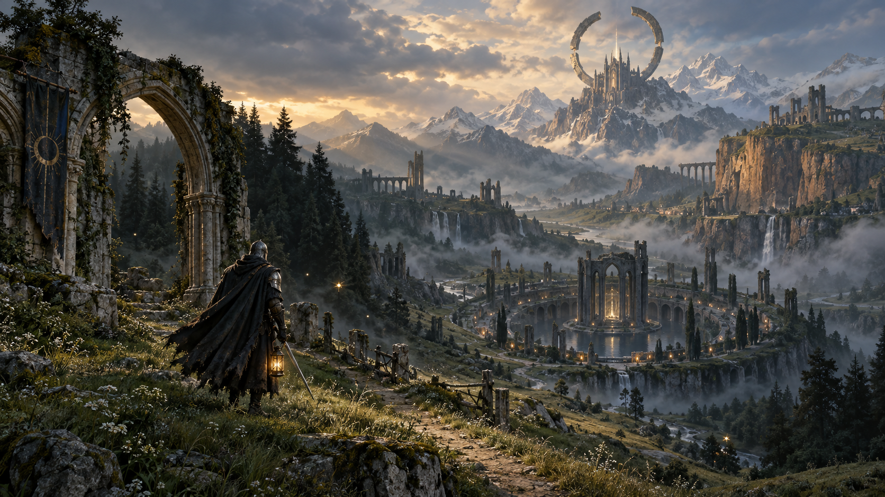

# Old Circle

An original dark fantasy action RPG built on **Meep 3.20.0**, with a shared persistent world and a reproducible Blender content pipeline. The game is under active development; the current playable world still needs substantial content and art work before release.



## Run

Requires Node 24+, pnpm 11, and a desktop browser with WebGPU. Shipped assets are already built; Blender and the inference models are needed only for authoring.

```powershell
pnpm install --frozen-lockfile
pnpm server                  # terminal 1: authoritative world, port 8787
pnpm dev                     # terminal 2: client, port 5188
```

Open **http://127.0.0.1:5188**. Without the server the Worker continues a solo world and retries the connection. The development proxy forwards `/multiplayer` to port 8787. Separate browser profiles provide separate characters.

```powershell
pnpm test
pnpm world:check
pnpm build
pnpm server                  # serves the built client at http://127.0.0.1:8787
```

The production host defaults to loopback. `HOST`, `PORT` and `OLD_CIRCLE_DATA_DIR` configure it. A remote deployment needs HTTPS/WSS for WebGPU and a secure browser context. Public hosting, authentication and operational deployment are not configured here.

The production build includes Brotli sidecars for compressible code and native assets. The host streams them when the browser accepts Brotli, with an uncompressed fallback. Geometry currently transfers in 27.3 MiB and decodes to the unchanged 115.7 MiB catalogue used by the offline cache. Compression runs during the build, outside the live simulation.

## Play

WASD walks, Shift sprints, C crouches, Space jumps and grabs nearby ledges. Keep Space held to climb; release it to hang, then press Space to climb or C to drop. Mouse looks; left click attacks; Q casts frost nova; R drinks a flask; E rests at a nearby hearth. Keys 1–4 select owned weapons. After sprint exhaustion, recover at least 25 stamina (or a quarter of maximum) and release Shift before sprinting again. Tab opens attributes, equipment and the hearth forge, saving and the PvP toggle; M opens the map. Escape releases the mouse and opens the journal. The journal pauses solo simulation; the shared world keeps running. In embedded browsers that reject pointer lock, free mouse look, edge turning and arrow keys remain available.

Choose a starting inventory and stat distribution, find weapons on enemies, earn embers and improve attributes at the hearth. The Bellkeeper's Hollow offers an early magic weapon. Six regional bosses grant seals. Players can enter ongoing encounters. Damage between players requires both to enable PvP. A defeated player returns to their checkpoint after four seconds and loses 25% of carried embers.

## Included

- `packages/game`: shared Meep ECS/physics simulation, collision combat, progression, enemies, encounters, world layout, navigation/visibility sampling and Meep network sessions.
- `packages/client`: WebGPU presentation, GPU particles, clustered lights, shadows, fog, TAA/GTAO/bloom, native binary geometry, SCSS UI and a simulation Worker.
- `packages/server`: persistent Node simulation, Meep transport integration, atomic world saves and static hosting.
- `assets/blender` and `tools`: Blender source, native geometry/collider export, local FLUX icons, local Stable Audio sounds and world inspection tools.

The current world is about 480 × 640 metres, with six connected biome zones and regional hearths, an abbey, a traversable rock hollow, six layered regional dungeons, five normal enemy archetypes and six keepers. The dungeons include a sunken cistern, a three-storey observatory and returning galleries, with thirty authored guards and personal treasures. The keepers add bell waves, root traps, cinder volleys, mirrored sigils, frost lines and a final judgment combination to their weapon attacks, with stronger patterns below half health. Five armor sets trade protection, poise, movement, stealth and resource recovery, with distinct Blender skins. Five exploration charms add mutually exclusive blessings and burdens for stamina, arrows, spells, protection or damage. Safe hearths change armor and charms, replenish a basic quiver and reinforce owned weapons up to seal-limited rank +6. The first reliquary's personal reward grants a permanent flask slot. All six seals unlock a personal ending in the journal; the shared world remains playable. Characters use Blender armatures and weighted skins, directional locomotion, jump/landing and weapon actions, played by Meep's animation system. Deaths transfer the skeleton to Meep ragdoll physics.

Each player receives a bounded nearby view through Meep's packed binary adapters and LZ4 compression. Prediction and replay run in a warm simulation Worker; Meep's adaptive render playout smooths presentation. Disconnects continue locally, and reconnect carries only the character into the authoritative world. The host defaults to eight players. Scenery uses authored detail levels and streams local scene instances; a complete serialized geometry cache supports travel after a connection loss. Native trails and decals present combat and foot contacts. Sopra uses geometric occlusion, material transmission and 1,033 baked reverb probes, with acoustic pathing disabled. See [architecture](docs/ARCHITECTURE.md) for authority, memory and operating limits. Public identity and internet transport remain release work.

## Develop

[Content workflow](docs/CONTENT_WORKFLOW.md) covers areas, enemies, geometry, sound, icons and checks. [Art and world direction](docs/DESIGN.md) defines the visual language and progression. [MEEP_DEFECTS.md](MEEP_DEFECTS.md) records verified engine integration findings. The local Meep checkout is read-only and is not linked as a writable package dependency.

Use **http://127.0.0.1:5188/?inspect=1** for the development-only world workshop. It runs offline, does not write the player's save, can visit landmarks, switch lighting, display occupancy/flow and save rendered compositions with metadata under `.local/captures`.

Character saves live in browser localStorage. The server saves `.local/server/world.meep` every 15 seconds and on graceful shutdown. `.local` contains generated, disposable or runtime data and is ignored by Git. Back up the server save directory separately when operating a persistent world.
